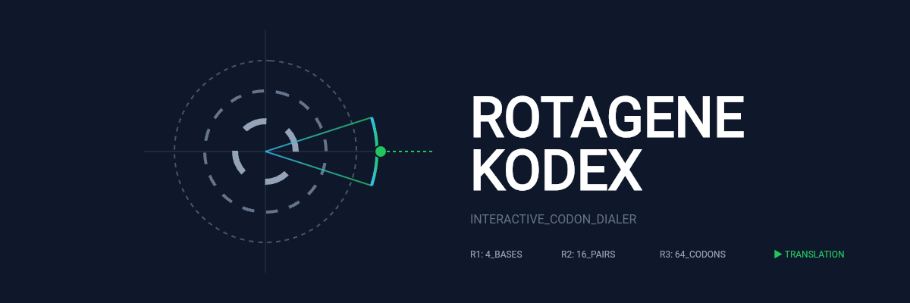

  

# 🧬 ROTAGENE KODEX

### Interactive Codon Dialer & Genetic Code Laboratory

Explore the genetic code through an interactive codon dialer, real-time translation, mutation simulation, and the complete 64-codon table.

---

## 📖 Overview

**ROTAGENE KODEX** is an open-source educational visualization of the **Genetic Code**, designed to simplify codon decoding and protein synthesis through interactive molecular biology tools. It combines a three-ring codon dialer, mutation analysis, and real-time translation into a browser-based learning experience.

---

## ✨ Features

- 🧬 Interactive 3-ring codon dialer
- 🔬 Real-time codon decoding
- 🧪 mRNA to protein translation
- 🧬 Mutation simulator
- 📖 Interactive 64-codon reference table
- ▶️ START & STOP codon navigation
- 📱 Responsive, browser-based interface

---

## 📜 License

GNU General Public License v3.0 (GPL-3.0)

---

## 👨‍🏫 Author

**Draven-Ashcroft**

**DIPS Chain of Institutions, Tanda**

---

## 🙏 Acknowledgements

Developed with assistance from modern AI tools.

Special thanks to:

- **OpenAI (ChatGPT)** — scientific review, debugging, and implementation
- **Anthropic Claude** — implementation assistance and optimization
- **Google Gemini** — concept exploration and refinement
- **Moonshot AI** — debugging and prototype refinement
- **DeepSeek** — early drafts and experimentation

Inspired by **NCERT Biology**, **BioRender**, and modern scientific visualization principles.

---

## 🧬 ROTAGENE KODEX

### *Decoding the Language of Life.*

